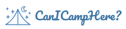

[](https://www.canicamphere.com)

# CanICampHere?

An interactive map that shows camping regulations across Switzerland. Find allowed, restricted, or prohibited camping spots and plan the next adventure! 🌲🏕️

> **Important Notice:**  
> Due to substantial ongoing development and significant code changes, the code in this repository is currently not open source and can't be contributed to at the moment.

## Table of Contents

- [CanICampHere?](#canicamphere)
  - [Table of Contents](#table-of-contents)
  - [Overview](#overview)
  - [Features](#features)
  - [Live Demo](#live-demo)
  - [Tech Stack](#tech-stack)
  - [Getting Started](#getting-started)
    - [Prerequisites](#prerequisites)
    - [Installation](#installation)
    - [Development](#development)
    - [Production Build](#production-build)
  - [Contributing](#contributing)
    - [Data Contributions](#data-contributions)
  - [Future Features](#future-features)
  - [License](#license)
  - [Acknowledgments](#acknowledgments)

## Overview

CanICampHere is a comprehensive, user-friendly resource that helps outdoor enthusiasts understand where camping is allowed, restricted, or prohibited throughout Switzerland.

Camping regulations in Switzerland are complex and vary by canton, municipality, and protected area status. This project tries to aggregate the necessary information to present it in an accessible format to support informed decisions and promote responsible outdoor recreation.

Information about camping regulations is provided to:

- Reduce illegal camping in protected or sensitive areas
- Assist outdoor enthusiasts in finding suitable camping locations
- Encourage responsible camping practices
- Preserve Switzerland's natural beauty for future generations

## Features

- 🛡️ **Restricted/Protected Areas:**  
  Toggle specific restricted or protected layers on/off and adjust their transparency. Simply hover over or click on these areas to view detailed information.

- 🏘️ **Municipalities Restrictions:**  
  Locate potential campsites based on local municipal rules. Interact with the map by hovering over or clicking on an area to see more details.

- 🔄 **Upload GPX Route:**  
  Import a GPX file to display or edit an existing route directly on the map.

- 📝 **Create a New Route:**  
  Define your custom route by adding up to 70 markers. Enjoy full route management with the ability to:

  - Move or delete existing markers.
  - Adjust and recalculate the route, with hiking paths favored.
  - Hover over or click on the route to view distance, elevation changes, expected time, and more.
  - Add camping spot markers to the route after you’ve saved it.

- 📤 **Export Route:**  
  Export your custom route to a GPX file for use in other mapping applications (please note that some apps may not support camp markers).

- 🌲 **Show Treeline:**  
  Toggle the treeline layer on/off to visualize forest boundaries and alpine transitions.

- 📍 **Current Position:**  
  Automatically locate and center the map on your current position for an enhanced navigation experience.

- 🔍 **Search Locations:**  
  Easily search for municipalities, peaks, huts, and other points of interest to quickly find what you need.

- 🎨 **Change Map Styles:**  
  Switch seamlessly between various map styles – including satellite, terrain, and more – to suit your preferences.

## Live Demo

Experience CanICampHere live at [CanICampHere](https://www.canICampHere.com)!

<div style="display: flex; gap: 10px;">
  
  
</div>

## Tech Stack

- **Framework:** [Next.js](https://nextjs.org/)
- **Styling:** [Tailwind CSS](https://tailwindcss.com/)
- **UI Components:** [shadcn/ui](https://ui.shadcn.com/)
- **Mapping:** [Leaflet](https://leafletjs.com/) / [React Leaflet](https://react-leaflet.js.org/)
- **Icons:** [Lucide React](https://lucide.dev/)
- **Language:** [TypeScript](https://www.typescriptlang.org/)

## Getting Started

### Prerequisites

- Node.js (v18 or newer)
- npm (v8 or newer)
- Git

### Installation

1. **Clone the Repository:**

   ```
   git clone https://github.com/astro-phage/canicamphere-app.git
   cd canicamphere-app
   ```

2. **Install Dependencies:**

   ```
   npm install
   ```

3. **Set Up Environment Variables:**

   Create a `.env.local` file in the root directory with:

   ```
   NEXT_PUBLIC_BASE_URL="http://localhost:3000"
   NEXT_PUBLIC_MUNICIPALITIES_DATA_URL="/sample-data/swiss-municipalities-topo.json"
   NEXT_PUBLIC_PROTECTED_AREAS_DATA_URL="/sample-data/protected-areas-topo.json"
   NEXT_PUBLIC_POINTS_OF_INTEREST_DATA_URL="/sample-data/points-of-interest-topo.json"
   NEXT_PUBLIC_TREELINE_DATA_URL="/sample-data/treeline-topo.json"
   ```

### Development

Start the development server:

    npm run dev

Then open http://localhost:3000 in a browser.

### Production Build

To build the application:

    npm run build

Then start the production server:

    npm start

## Contributing

Contributions are welcome. To contribute, follow these steps:

1. **Browse Issues:** Check the [Issues](https://github.com/astro-phage/canicamphere-app/issues) page for tasks or ideas.
2. **Fork the Repository:** Create a personal copy.
3. **Create a Branch:**

   ```
   git checkout -b feature/your-feature-name
   ```

4. **Make Changes & Test:** Adhere to the project guidelines.
5. **Commit & Push:**

   ```
   git commit -m "Add feature: [short description]"
   git push origin feature/your-feature-name
   ```

6. **Open a Pull Request**

### Data Contributions

For any inaccuracies in the camping data, use the "Report inaccurate data" option in the map tooltips or open an issue with official sources.

## Future Features

- 🌍 **Global Expansion:**  
  Expand coverage to include camping regulations from additional countries, creating a truly international resource.

- 🌐 **Multilingual Support:**  
  Extend the user interface with multilingual translations for tooltips and other elements, making the platform accessible for non-English speakers.

- ⛺ **Designated Campsites:**  
  Highlight official or designated campsites on the map, allowing users to easily identify approved camping locations.

- 🔠 **Translated Points of Interest:**  
  Provide localized names for points of interest to enhance search functionality and navigation for international users.

- 🚀 **Enhanced Map Performance:**  
  Optimize the mapping engine, potentially integrating other engines like MapLibre and vector tiles, to maintain smooth performance as new features are added.

- 📡 **PWA & Offline Mode:**  
  Develop a Progressive Web App with offline capabilities so users can access routing and other features even without a constant internet connection.

- 🏢 **Public Property Data:**  
  Integrate detailed public property datasets to display government-owned lands and other public spaces relevant to camping activities.

- 🖥️ **Full-Screen Mode:**  
  Introduce a full-screen viewing option to offer an immersive experience on both desktop and mobile devices.

## License

This project is licensed under the MIT License - see the [LICENSE](LICENSE) file for details.

The following website content requires explicit permission for reuse:

- **Graphical Elements:** All logos, icons, and illustrations.
- **Camping Restriction Data:** Data provided by municipalities.
- **Map Customizations:** Custom map styling and visualizations.
- **Proprietary Photographs:** Images marked as proprietary.

The camping restriction data compiled from various sources is provided for informational purposes only. For commercial use or redistribution, please contact us to request permission.

## Acknowledgments

- 🌍 OpenStreetMap for the base map data.
- 🌍 OpenRouteService for the Routing-Service.
- 🗺️ swisstopo for geographic information.
- 🌱 FOEN for protected areas data.
- 🏕️ TCS for camping regulation information.
- ♻️ Leave No Trace Center for Outdoor Ethics for promoting outdoor ethics.
- 🙌 Thanks to all contributors who have supported this project.

Made with ❤️ by CanICampHere
